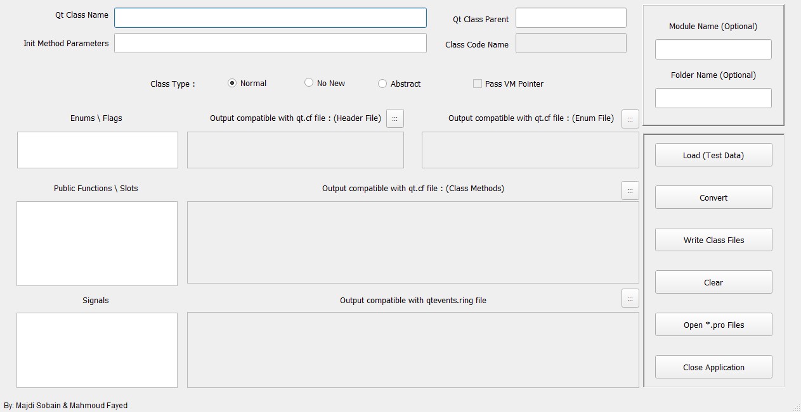

# Qt Class Converter for RingQt code generator

This is a nice tool that helps in implementation of new Qt classes into RingQt by converting Qt class functions prototype for easier and quicker implementation and building.

This tool has been made to reduce pain for those who are new to the Ring Extension Code Generator and Qt framework specifications. So that, this tool will do most of the work, simply by some mouse clicks and basic understanding of Ring and RingQt building process.

## Features

1. Give all required code for RingQt code generator

2. Auto creation of class codename.

3. Complete "qtevents.ring" list creation.

4. Auto apply numerical additions for the functions of the same name (overriding functions).

5. Smart implementation of enums and flags to avoid duplication.

6. Auto creation of function standard substitution if there's a conflict with Ring keyword.

7. Delete unnecessary functions automatically (initialization and delete functions, and operators functions).

## Getting Started

To get a quick idea about the required input for the application

1. Open QtClassConverter application.

2. Click "Load (Test Data)" - this will set the required input for the QChart class as an example

3. Click "Convert" To see the required output

4. Click "Write Class Files" to write the next files

	* ring/extensions/ringqt/classes/charts/qchart.cf  (For the class methods)
	* ring/extensions/ringqt/events/charts/qchart.ring (For the class events)

5. **The next steps could be automated by the tool in the future - But we keep these manual steps for better control** 

6. Click ":::" button - After (Header File)

	* This will copy the #include commands to the Clipboard
	* Then will open qt_headerfiles.cf
	* So we can add the header files (if it's not added before)

7. Click ":::" button - After (Enum File)

	* The will copy the code that update the aEnumTypes list to the Clipboard
	* Then will open qt_enumtypes.cf
	* So we can add the new code to the file 

8. Click ":::" button - After (Class Methods)

	* This will open qt_module_charts.cf to add the new class to the module file

9. Click ":::" button - After (qtevents.ring)
	
	* This will open qtevents_files.ring to add the new events file

10. Click "Open *.pro Files" to add the new class files to the project file

## How to Use

1. **Be sure that the class you want to be added is not already present in RingQt**.

2. Open QtClassConverter application.

3. Search for Qt Class that is needed to be added, and open its documentation page.

4. Copy the class name from documentation page then paste it into "Class name" textbox in the application.

5. Copy class parent from documentation page, which could be found on the right side of "Inherits" word in the first table in the page, and paste it in the "Class parent" textbox of the application.

6. Copy parameters of the initialization function if present (the function that has the same name of the class), and paste it in the "Init method parameters" textbox. If there are more than one initialization function, just copy the parameters of the first one.

7. Copy enums and flags from documentation page and paste them into the "Enums \ Flags" textbox in the application.

8. Copy all public functions and slots from documentation page and paste them in the "Public Functions and Slots" textbox.

9. Copy all signals from documentation page and paste them in the "Signals" textbox.

10. You can check "Pass VM Pointer" checkbox if you have some signals because it's almost always used if they are present.

11. If the class that you want to convert does not need to be initialized, just check "No New" type from the class types above.

12. If the class that you want to convert is abstract class check "Abstract" type from the class type selection. To know whether the class is abstract or not you can easily figure it out if the class name contain "abstract" word, or you can discover that from reading the detailed description of the class.

13. Click "Convert" button to get output.

14. Click "Write Class Files"

15. Click on each ":::" button to open the required file and add the required information

16. Click on "Open *.pro Files" to add the new files to the project

17. Build the extension (And You Are Done  :smiley:)
